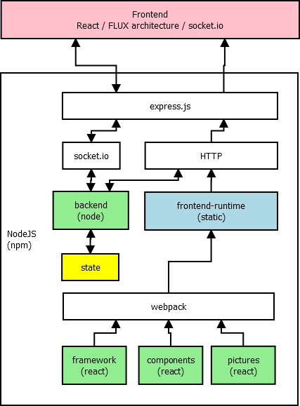

# node-visu

Messing around with some new hyped techs.

**HMI system based on following :**
* Screens designed in SVG / Modularization via ReactJS component model
* Node-JS as backend (current object state in memory)
* ReactJS (flux architecture) for frontend
* NPM / webpack build system
* Libs as external resources
* IntelliJ IDE as IDE
* Docker / micro service architecture possible
* testing with jest / react-addons-test-utils

## setup environment
* run `npm install`
* run `npm install webpack -g`
* run `npm install copyfiles -g`
* npm script `build-libs` copies client libraries from node_modules to exposed folder
* npm script `build-debug-all` builds client webapp in debug mode
* npm script `build-prd-all` builds client webapp in production mode
* npm script `start-server` starts the backend
