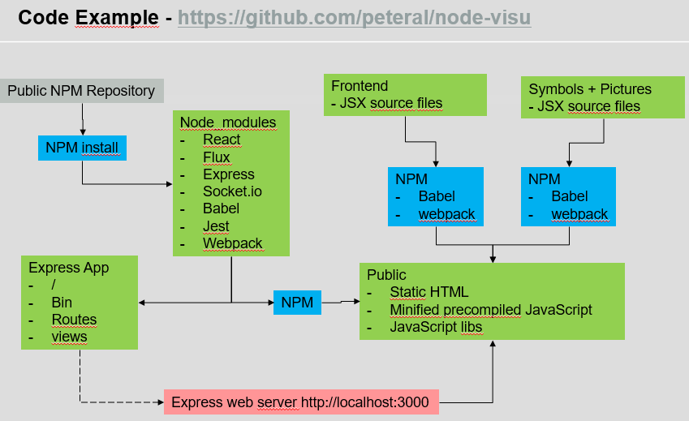

# node-visu

Messing around with some new hyped techs.

**HMI system based on following :**
* Screens designed in SVG / Modularization via ReactJS component model
* Node-JS as backend (current object state in memory)
* ReactJS (flux architecture) for frontend
* NPM / webpack build system
* Libs as external resources
* IntelliJ IDE as IDE
* Docker / micro service architecture possible
* testing with jest / react-addons-test-utils

## setup environment
### install required packages
* run `npm install`
* run `npm install webpack -g`
* run `npm install copyfiles -g`

### compile client code
* run `npm run-script build-all`

### start server
* run `npm run-script start-server`
